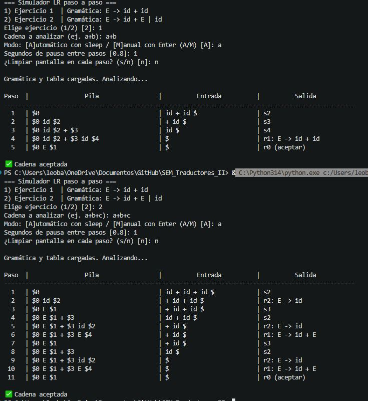

# `sintactico.py` — Analizador Sintáctico LR (versión procedural)

Simulador de análisis sintáctico LR (shift-reduce) que muestra en consola, paso a paso, el contenido de la pila, la entrada restante y la acción tomada (`shift`, `reduce` o `accept`).

Esta versión corresponde a la práctica anterior: está implementada de forma **funcional/procedural**, usando funciones sueltas y estructuras de datos básicas de Python (listas, tuplas y diccionarios) para representar la pila, las producciones y las tablas ACTION/GOTO.

## Contenido del archivo

- `tokenize(raw)` — convierte una cadena de entrada en una lista de tokens (`id`, `+`, `$`).
- `formatea_pila(stack)` — da formato de texto a la pila (`$0 id $2 + $3 ...`).
- `simulate_lr(...)` — función principal que ejecuta el algoritmo LR paso a paso sobre una pila representada como lista (`[estado, símbolo, estado, símbolo, ...]`).
- `PROD_1/2`, `ACTION_1/2`, `GOTO_1/2` — producciones y tablas de los dos ejercicios de ejemplo.
- `main()` — interfaz de línea de comandos (CLI).

## Gramáticas de ejemplo

1. **Ejercicio 1**: `E -> id + id`
2. **Ejercicio 2**: `E -> id + E | id`

## Requisitos

- Python 3.8 o superior (no requiere librerías externas).

## Cómo ejecutar

```bash
python3 sintactico.py
```

Durante la ejecución se te pedirá:

1. Elegir el ejercicio (`1` o `2`).
2. Escribir la cadena a analizar (por ejemplo `a+b` o `a+b+c`).
3. Elegir modo automático (con pausa en segundos) o manual (avanzar con Enter).
4. Decidir si se limpia la pantalla en cada paso.

El programa imprime una tabla con las columnas **Paso**, **Pila**, **Entrada** y **Salida**, y al final indica si la cadena fue aceptada o si ocurrió un error de análisis.

## Captura de ejecución

Agrega aquí la captura de pantalla de la ejecución de `sintactico.py` en la terminal (por ejemplo, analizando `a+b` con el Ejercicio 1).



> Sugerencia: guarda la imagen en una carpeta `capturas/` junto a este README, con el nombre `sintactico.png`, para que el enlace de arriba se muestre correctamente en GitHub o en el visor de Markdown.
