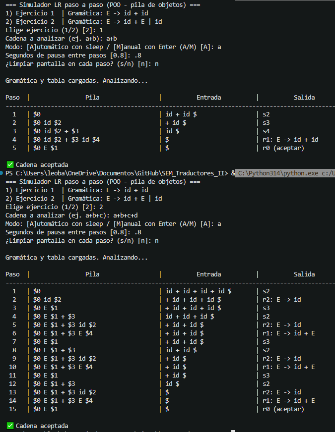

# `sintactico_objetos.py` — Analizador Sintáctico LR(1) con pila de objetos (Práctica 3)

Reimplementación orientada a objetos de `sintactico.py`, siguiendo las indicaciones de la **Práctica 3 — Analizador Sintáctico LR(1), Implementación usando Objetos**: en lugar de que la pila del autómata LR guarde enteros/strings sueltos, ahora guarda **objetos**, de modo que al imprimir la pila se ven los símbolos tal como se escribirían al hacer el análisis a mano.

## Relación con la práctica

La práctica pide:

- Una clase **`ElementoPila`**, de la cual heredan las demás clases que se guardan en la pila (equivalente a la clase `Alumno` del ejemplo).
- Tres clases que heredan de `ElementoPila`: **`Terminal`**, **`NoTerminal`** y **`Estado`**.
- Modificar la pila (`push`, `pop`, `top`, `muestra`) para que trabaje con `ElementoPila*` en lugar de enteros.

Esto se implementó así en Python:

| Elemento de la práctica (C++) | Clase en este archivo |
|---|---|
| `Alumno` (clase base) | `ElementoPila` |
| Subclases de `Alumno` (`Bachillerato`, `Licenciatura`) | `Terminal`, `NoTerminal`, `Estado` |
| `Pila::push/pop/top/muestra` | `PilaLR.push/pop/top/muestra` |
| Entero suelto para representar un estado | `Estado(numero)` |
| Símbolo terminal apilado (p. ej. `'id'`, `'+'`) | `Terminal(simbolo)` |
| Símbolo no terminal apilado (p. ej. `'E'`, `"S'"`) | `NoTerminal(simbolo)` |

Cada clase implementa su propio método `muestra()` (equivalente al `muestra()` polimórfico del ejemplo de `Alumno`), y `PilaLR.muestra()` recorre la pila llamando al `muestra()` de cada elemento, igual que `Pila::muestra()` en el ejemplo de la práctica.

## Otras clases del archivo

Además de la jerarquía de la pila, se mantienen (igual que en `sintactico.py`, pero en versión de clases) los siguientes componentes:

- `Produccion` — una producción de la gramática (`A -> beta`).
- `Accion` — una entrada de la tabla ACTION (`shift`, `reduce` o `accept`).
- `Tokenizador` — convierte la cadena de entrada en tokens.
- `Pantalla` — imprime el encabezado y cada fila de la simulación.
- `SimuladorLR` — ejecuta el algoritmo LR paso a paso usando `PilaLR`.
- `Ejercicio` — agrupa producciones + tablas ACTION/GOTO + cadena de ejemplo.
- `AplicacionCLI` — interfaz de línea de comandos (menú, preguntas al usuario).

## Gramáticas de ejemplo

1. **Ejercicio 1**: `E -> id + id`
2. **Ejercicio 2**: `E -> id + E | id`

## Requisitos

- Python 3.8 o superior (no requiere librerías externas).

## Cómo ejecutar

```bash
python3 sintactico_objetos.py
```

Durante la ejecución se te pedirá lo mismo que en `sintactico.py`:

1. Elegir el ejercicio (`1` o `2`).
2. Escribir la cadena a analizar (por ejemplo `a+b` o `a+b+c`).
3. Elegir modo automático (con pausa en segundos) o manual (avanzar con Enter).
4. Decidir si se limpia la pantalla en cada paso.

El programa imprime la misma tabla con columnas **Paso**, **Pila**, **Entrada** y **Salida** — con la diferencia de que ahora, internamente, cada elemento de la columna **Pila** se genera a partir de un objeto (`Estado`, `Terminal` o `NoTerminal`) en lugar de un valor suelto.

## Captura de ejecución



